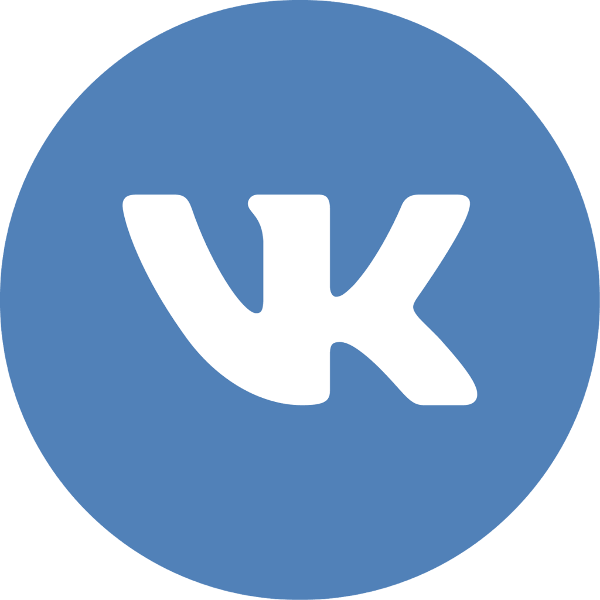

### Hi there 👋, I am Danil!
#### I am fourth year CS student and C++ developer

Skills: 

### About me

- 🎓 I am fourth-year computer science student at ITMO University
- 🌱 I’m currently learning C++, Python
- 💬 [CV](src/cv) for more details about me
- 📫 How to reach me: dennymf@yandex.ru 

  
<!--
**Dennymf/Dennymf** is a ✨ _special_ ✨ repository because its `README.md` (this file) appears on your GitHub profile.

Here are some ideas to get you started:

- 🔭 I’m currently working on ...
- 🌱 I’m currently learning ...
- 👯 I’m looking to collaborate on ...
- 🤔 I’m looking for help with ...
- 💬 Ask me about ...
- 📫 How to reach me: ...
- 😄 Pronouns: ...
- ⚡ Fun fact: ...
-->
